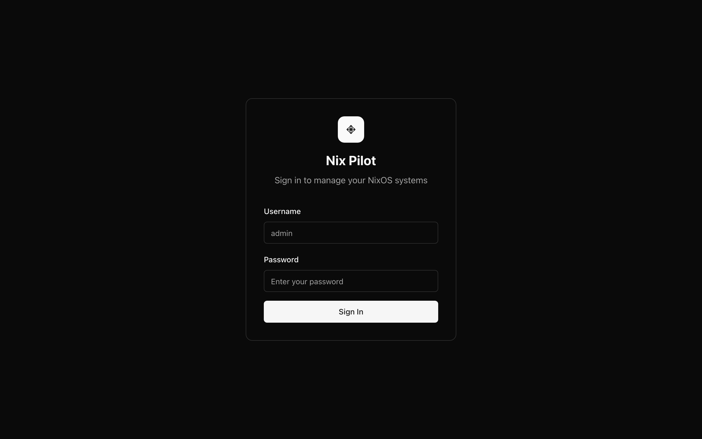
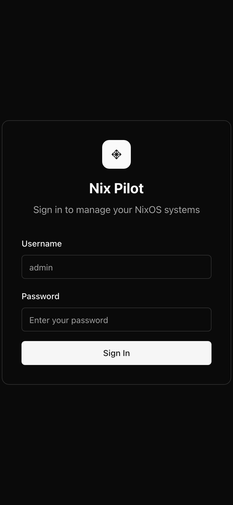

# Nix Pilot

A web-based management interface for NixOS and nix-darwin systems. Manage flakes, services, secrets, and system rebuilds through a modern, responsive web UI.

## Screenshots

<p align="center">
  
  <br/>
  <em>Dashboard - System overview and quick actions</em>
</p>

<p align="center">
  
  <br/>
  <em>Services - Manage systemd services with real-time logs</em>
</p>

<p align="center">
  
  <br/>
  <em>Flakes - Register and manage Nix flakes</em>
</p>

<p align="center">
  
  <br/>
  <em>Rebuild - NixOS/nix-darwin system rebuild with live output</em>
</p>

<p align="center">
  
  <br/>
  <em>Nix Operations - GC, store optimization, and flake checks</em>
</p>

<p align="center">
  
  <br/>
  <em>Responsive mobile interface</em>
</p>

## Features

### Machine Management
- Register and manage multiple NixOS machines
- SSH connection testing and status monitoring
- Support for SSH agent, key file, and password authentication
- View system information and connection details

### Flake Management
- Register and track Nix flakes
- View flake metadata, inputs, and outputs
- Update flake inputs and lock files
- Browse NixOS configurations, packages, and dev shells

### Deployment
- Deploy NixOS configurations via `nixos-rebuild`
- Support for `switch`, `boot`, and `test` modes
- Real-time deployment output streaming via WebSocket
- View and manage system generations
- Rollback to previous configurations

### Service Management
- List and manage systemd services on remote machines
- Start, stop, restart, and reload services
- View service status and details
- Stream service logs in real-time via `journalctl`
- Filter and download logs

### Secret Management
- SOPS-encrypted secrets with age encryption
- Compatible with [sops-nix](https://github.com/Mic92/sops-nix)
- Generate and manage age keys
- Create, view, and manage encrypted secrets
- Support for various secret types (text, SSH keys, certificates, env files)

### Nix Operations
- Package search across nixpkgs
- Nix store information and path queries
- Garbage collection with real-time progress
- Store optimization

### NixOS Installation
- Install NixOS on remote machines via [nixos-anywhere](https://github.com/nix-community/nixos-anywhere)
- Support for disk image mode
- VM testing before installation
- Real-time installation progress streaming

## Architecture

```
nix-pilot/
├── np-core/       # Core library - SSH, machine management, Nix operations
├── np-api/        # REST API server (Axum)
├── np-ui/         # Web frontend (Leptos/WASM)
└── flake.nix      # Nix flake with NixOS module
```

### Technology Stack

- **Backend**: Rust, Axum, Tokio
- **Frontend**: Leptos (Rust WASM framework), Tailwind CSS
- **Build**: Nix flakes, Crane
- **Secrets**: SOPS, age encryption

## Installation

### NixOS Module

Add nix-pilot to your flake inputs:

```nix
{
  inputs = {
    nixpkgs.url = "github:NixOS/nixpkgs/nixos-unstable";
    nix-pilot.url = "github:maulanasdqn/nix-pilot";
  };

  outputs = { nixpkgs, nix-pilot, ... }: {
    nixosConfigurations.myhost = nixpkgs.lib.nixosSystem {
      system = "x86_64-linux";
      modules = [
        nix-pilot.nixosModules.default
        {
          services.nix-pilot = {
            enable = true;
            port = 3001;
            address = "127.0.0.1";
            auth = {
              enable = true;
              username = "admin";
              password = "your-secure-password";
            };
          };
        }
      ];
    };
  };
}
```

### With Nginx Reverse Proxy

```nix
{
  services.nix-pilot = {
    enable = true;
    port = 3001;
    address = "127.0.0.1";
  };

  services.nginx = {
    enable = true;
    virtualHosts."manage.example.com" = {
      enableACME = true;
      forceSSL = true;
      locations."/" = {
        proxyPass = "http://127.0.0.1:3001";
        proxyWebsockets = true;
      };
    };
  };
}
```

### Module Options

| Option | Type | Default | Description |
|--------|------|---------|-------------|
| `enable` | bool | `false` | Enable nix-pilot service |
| `port` | int | `3000` | Port to listen on |
| `address` | string | `"127.0.0.1"` | Address to bind to |
| `dataDir` | path | `/var/lib/nix-pilot` | Data directory |
| `user` | string | `"nix-pilot"` | Service user |
| `group` | string | `"nix-pilot"` | Service group |
| `openFirewall` | bool | `false` | Open firewall port |
| `auth.enable` | bool | `true` | Enable authentication |
| `auth.username` | string | `"admin"` | Admin username |
| `auth.password` | string | `"changeme"` | Admin password |
| `secrets.enable` | bool | `false` | Enable SOPS secrets |
| `secrets.ageKeyFile` | path | `null` | Age key file path |
| `secrets.sopsFile` | path | `null` | SOPS file path |

## Development

### Prerequisites

- Nix with flakes enabled
- Rust toolchain (provided by dev shell)

### Setup

```bash
# Enter development shell
nix develop

# Run API server (port 3000)
just api

# Run UI development server (port 8080)
just ui

# Run both concurrently
just dev

# Build all packages
just build

# Run tests
just test

# Run clippy and formatting checks
just check
```

### Environment Variables

| Variable | Default | Description |
|----------|---------|-------------|
| `NP_PORT` | `3000` | API server port |
| `NP_ADDRESS` | `127.0.0.1` | Bind address |
| `NP_DATA_DIR` | `./data` | Data directory |
| `NP_STATIC_DIR` | `./static` | Static files directory |
| `NP_AUTH_ENABLED` | `true` | Enable authentication |
| `NP_AUTH_USERNAME` | `admin` | Admin username |
| `NP_AUTH_PASSWORD` | `changeme` | Admin password |
| `NP_AGE_KEY_PATH` | - | Path to age key for secrets |

## API Endpoints

### Authentication

```
POST /api/auth/login      # Login with username/password
POST /api/auth/logout     # Logout and invalidate token
GET  /api/auth/check      # Check authentication status
```

### Machines

```
GET    /api/machines           # List all machines
POST   /api/machines           # Add a new machine
GET    /api/machines/:id       # Get machine details
DELETE /api/machines/:id       # Delete a machine
POST   /api/machines/:id/test  # Test SSH connection
```

### Services

```
GET  /api/machines/:id/services              # List services
GET  /api/machines/:id/services/:name        # Get service details
POST /api/machines/:id/services/:name/:action  # Control service (start/stop/restart)
GET  /api/machines/:id/services/:name/logs   # Get service logs
```

### Flakes

```
GET    /api/flakes              # List registered flakes
POST   /api/flakes              # Register a flake
GET    /api/flakes/:id          # Get flake details
DELETE /api/flakes/:id          # Unregister a flake
GET    /api/flakes/:id/outputs  # Get flake outputs
POST   /api/flakes/:id/update   # Update flake inputs
```

### Deployment

```
POST /api/deploy              # Start deployment
GET  /api/deploy/generations  # List generations
POST /api/deploy/rollback     # Rollback to generation
```

### Secrets

```
GET    /api/secrets           # List secrets
POST   /api/secrets           # Create a secret
GET    /api/secrets/:id       # Get secret details
DELETE /api/secrets/:id       # Delete a secret
GET    /api/secrets/keys      # List age keys
POST   /api/secrets/keys      # Generate/import age key
```

### Nix Operations

```
GET  /api/nix/store           # Get store info
GET  /api/nix/search          # Search packages
GET  /api/nix/path/:path      # Get path info
POST /api/nix/gc              # Run garbage collection
```

### WebSocket Endpoints

```
WS /api/ws/deploy/:job_id     # Deployment progress stream
WS /api/ws/logs/:machine/:service  # Live log streaming
WS /api/ws/install/:job_id    # Installation progress stream
```

## Security Considerations

- Always use HTTPS in production (via reverse proxy)
- Change default credentials immediately
- Bind to localhost and use a reverse proxy for external access
- The service runs with restricted permissions by default
- SSH connections use the server's SSH agent or specified keys
- Secrets are encrypted at rest using age/SOPS

## Building from Source

```bash
# Build all packages
nix build

# Build specific packages
nix build .#np-api      # API server only
nix build .#np-ui       # UI assets only
nix build .#nix-pilot   # Combined package

# Run directly
nix run
```

## Contributing

1. Fork the repository
2. Create a feature branch
3. Make your changes
4. Run `just check` to verify
5. Submit a pull request

## License

MIT License. See [LICENSE](LICENSE) for details.

## Related Projects

- [nixos-anywhere](https://github.com/nix-community/nixos-anywhere) - Install NixOS anywhere via SSH
- [sops-nix](https://github.com/Mic92/sops-nix) - Secrets management for NixOS
- [deploy-rs](https://github.com/serokell/deploy-rs) - Multi-profile Nix deployment tool
